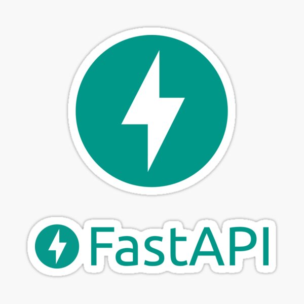

### **
Software Engineer
**

- ✏️ Interested In : **Python, Django, FastAPI, DevOps, Machine Learning, Mobile Application**

- ☕ Hobby : **Music, Anime, Game, Coffee and Tea, Watching Movies**

- ⚡ Fun project : **Always want to do Exciting project**

   

## My Skill Set

<table><tr><td valign="top" width="33%">

### Frontend

  
  
  
  
  

  

### Machine Learning

  
  
  
  
  

</td><td valign="top" width="33%">

### Backend

  
  
  

  
  
  

</td><td valign="top" width="33%">

### DevOps

  
  
  
  
  
 
  
  

  

### Mobile

  

  

</td></tr></table>  

   

## BIO

Senior Software Engineer specializing in Backend Python Development and DevOps, with over 5 years of experience in consulting, fintech, AI,
and e-commerce. have a proven track record in building scalable applications, RESTful APIs, and automating DevOps pipelines. Proficient in
Python, Django, FastAPI, and AWS, experienced in designing infrastructure as code, CI/CD pipelines, and container orchestration with Docker.

   

###

<h3 align="left">🔥 My Stats :</h3>

###

  
  
  

###

## Connect with me

  

   

---

### **
Some Projects
**

---
